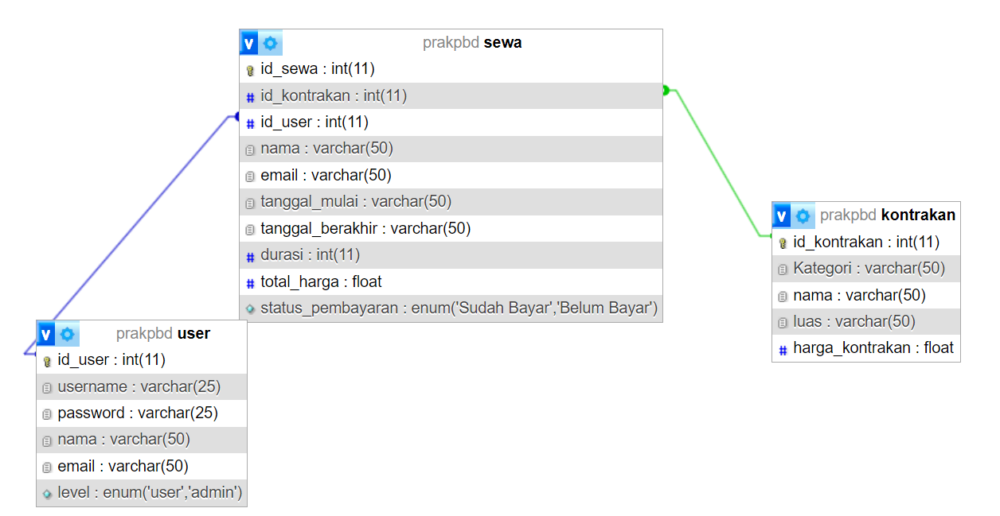
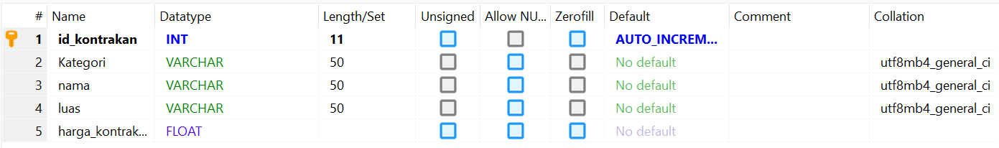
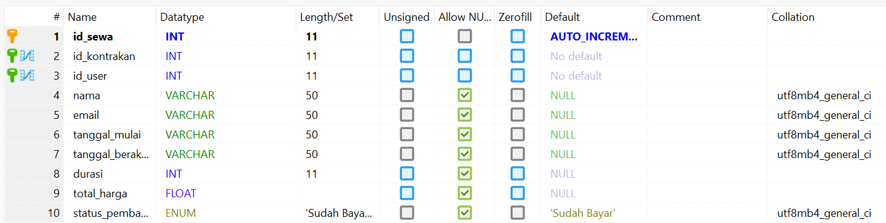
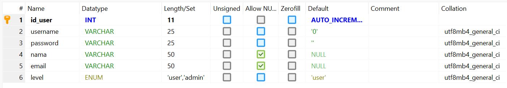

# Aplikasi Penjualan Rumah

Aplikasi ini merupakan sistem informasi yang dirancang untuk mendukung proses **penjualan dan penyewaan rumah**. Sistem ini dikembangkan menggunakan **Delphi 7** sebagai antarmuka pengguna (UI) dan **MySQL** sebagai sistem manajemen basis data.

## Teknologi yang Digunakan

- **Delphi 7** – digunakan untuk membangun aplikasi desktop
- **MySQL** – digunakan sebagai sistem basis data untuk menyimpan data pengguna, rumah, penyewaan, dan transaksi

## Design Database

## Panduan Instalasi

1. Clone repository ini.
2. Buka file `.dpr` menggunakan Delphi 7.
3. Sesuaikan konfigurasi koneksi ke database MySQL.
4. Jalankan aplikasi melalui Delphi.
